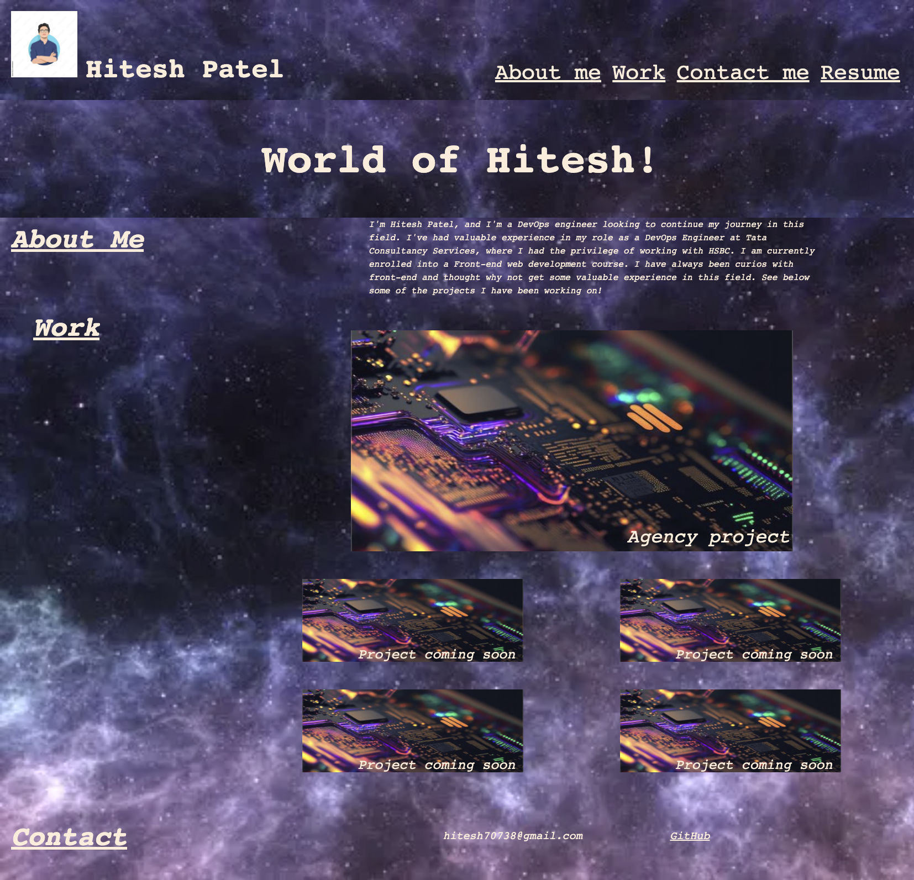

# World-of-hitesh

## Task

 I had to add to create a portfolio page, which follows the certain criteria:

<ol>
<li>When the page is loaded the page presents your name, a recent photo or avatar, and links to sections about you, your work, and how to contact you
<li>When one of the links in the navigation is clicked then the UI scrolls to the corresponding section
<li>When viewing the section about your work then the section contains titled images of your applications
<li>When presented with the your first application then that application's image should be larger in size than the others
<li>When images of the applications are clicked then the user is taken to that deployed application
<li>When the page is resized or viewed on various screens and devices then the layout is responsive and adapts to my viewport
</ol>

## Approach

I used the activitys from the two weeks to help create the portfolio page. I have added comments to the code to help navigate through the code. 

## Github Pages Link
https://hitesh70738.github.io/world-of-hitesh/

## Conclusion

Overall, this task was an excelent way to understand how to create a portfolio for myself. The material over the past two weeks has helped me greatly in helping to understand certain concepts with html and css.

## Website Image

